# Design decisions
We decided on creating separate pages for adding items, modifying items, and the original list to make our code as modularized as possible. Here are final designs for each of our pages:
## Adding items
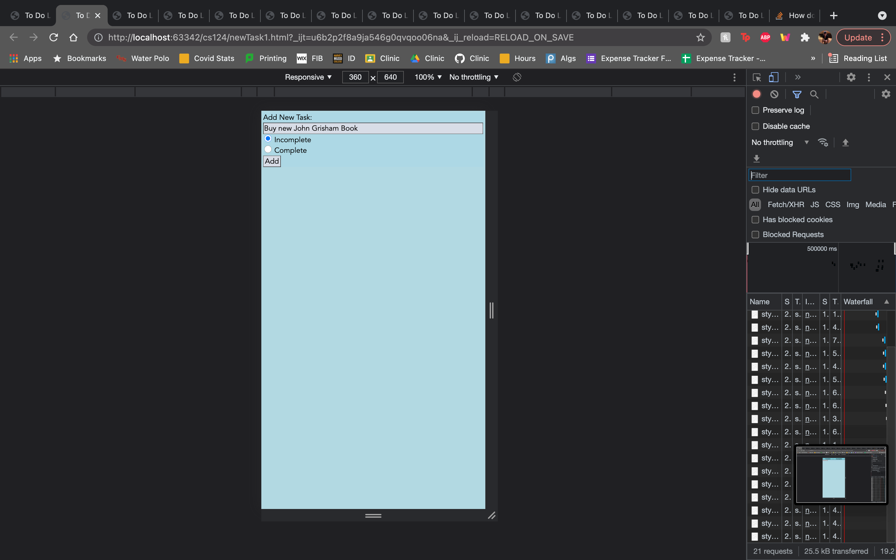
## Modifying items
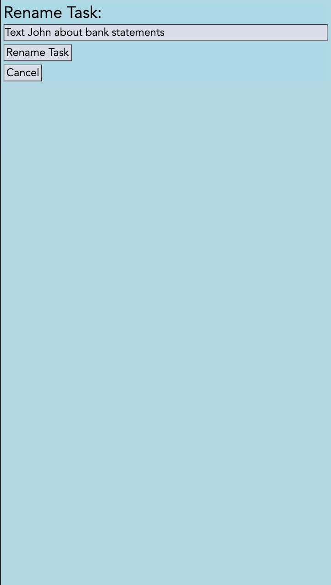
## Original list
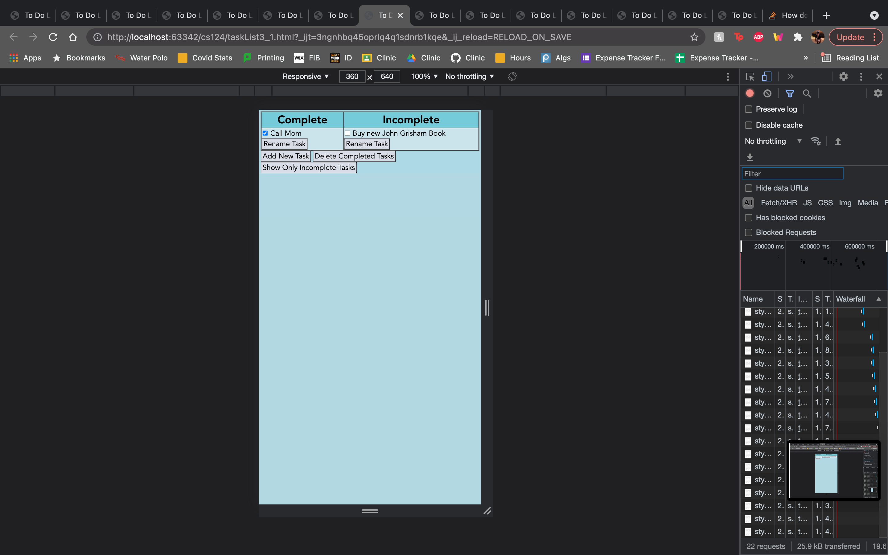

# Alternative designs
## Initial ideas
Initially, we wanted to do only two separate pages, one to modify items and another to add items and hold the whole to do list. We ended up deciding to do a separate page for adding items, as you will see later, to keep our to do list page as simple and readable for the user as possible.

## First iteration of final design
This is our first iteration of separate pages to add tasks, modify tasks, and hold our whole to do list. We decided that this was the overall way to go since it made the actual to do list as simple and easy to read as possible, however we wanted to play with moving around buttons and fixing the text to be as clear and readable as possible.

## Cleaning up final design
This is what we decided on for our final design. We focused on making it modularized, easy to use, and as intuitive as possible. We made our labels descriptive while minimizing text so that users wouldn't have to read very much, but could just skim to get an easy understanding of what to do.

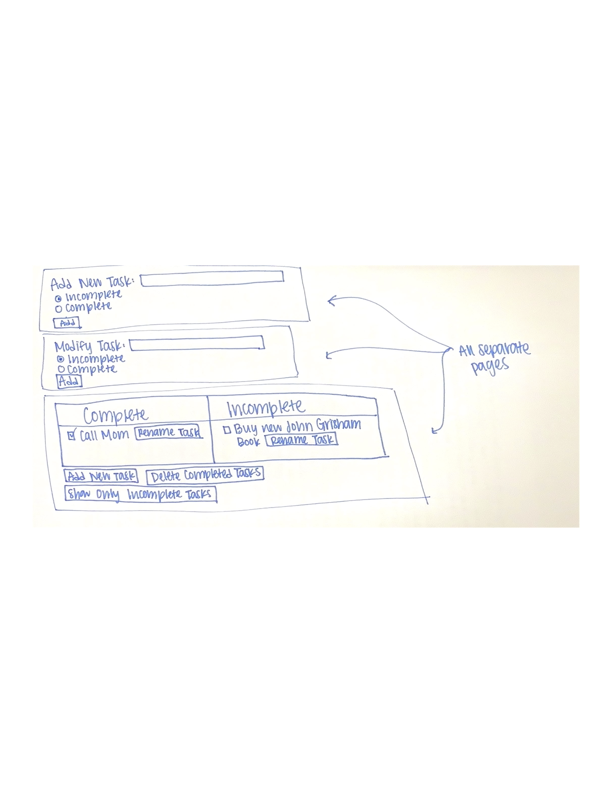

# User testing
# Final design
## In an empty list, create an item named "Buy new John Grisham book"
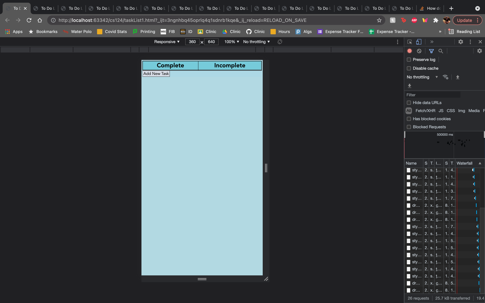

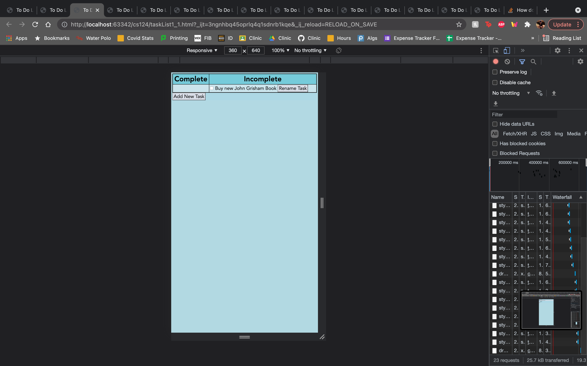
## In a non-empty list, create an item named "Eat Lunch"

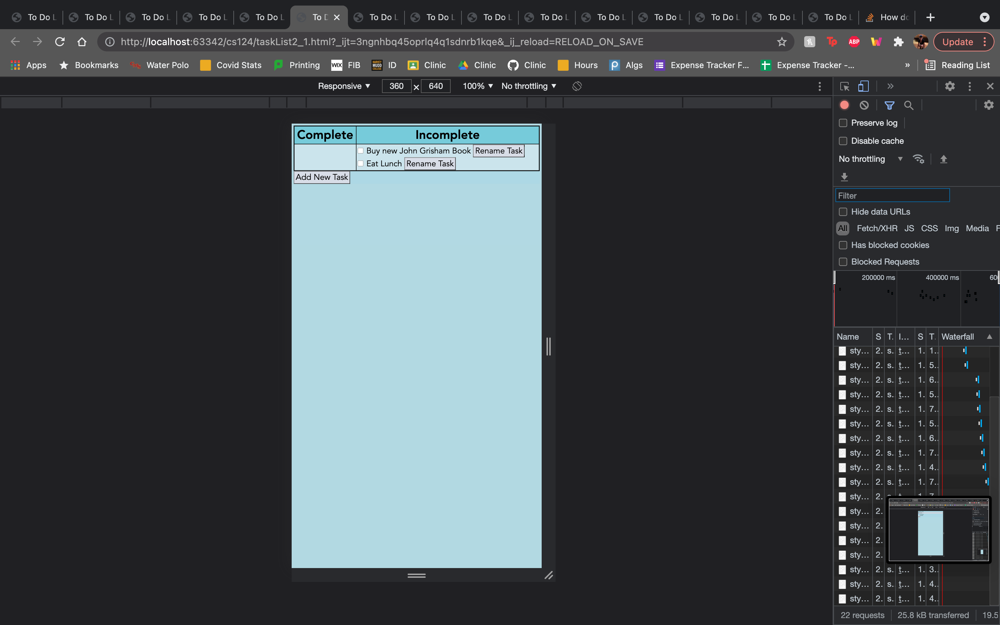
## Mark the item named "Call Mom" completed (assumes there exists an item named "Call Mom").
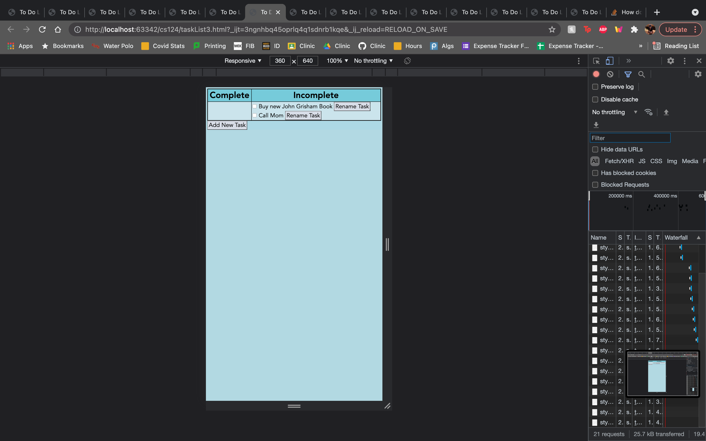

## Rename the item "Text John" to "Text John about bank statements" (assumes there exists an item named "Text John").

## Show all uncompleted tasks.
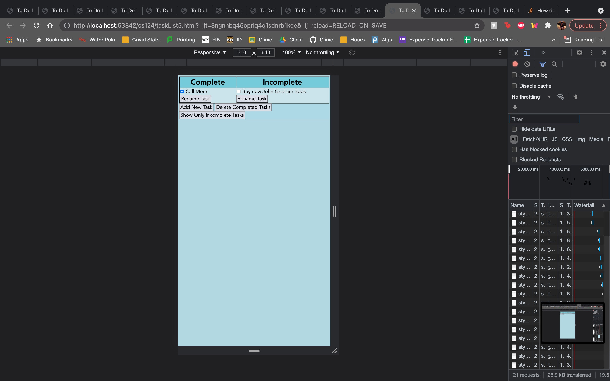
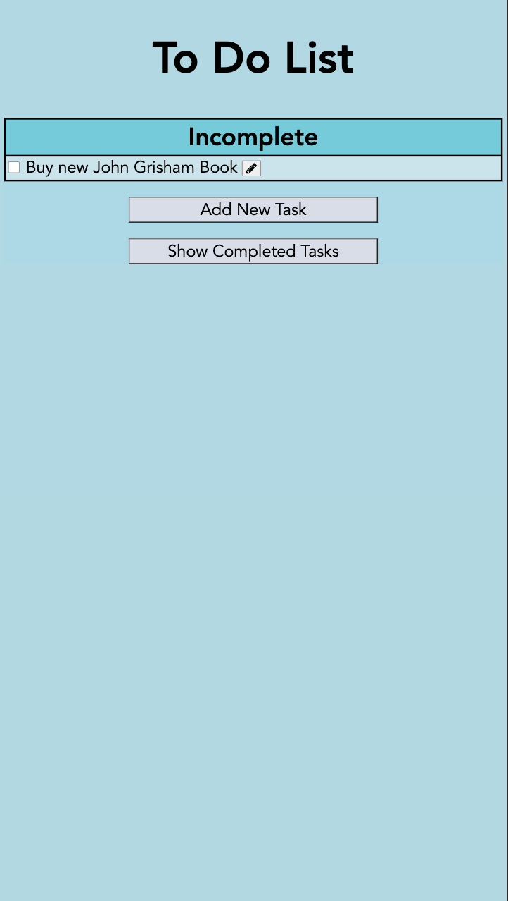
## Delete all completed tasks.
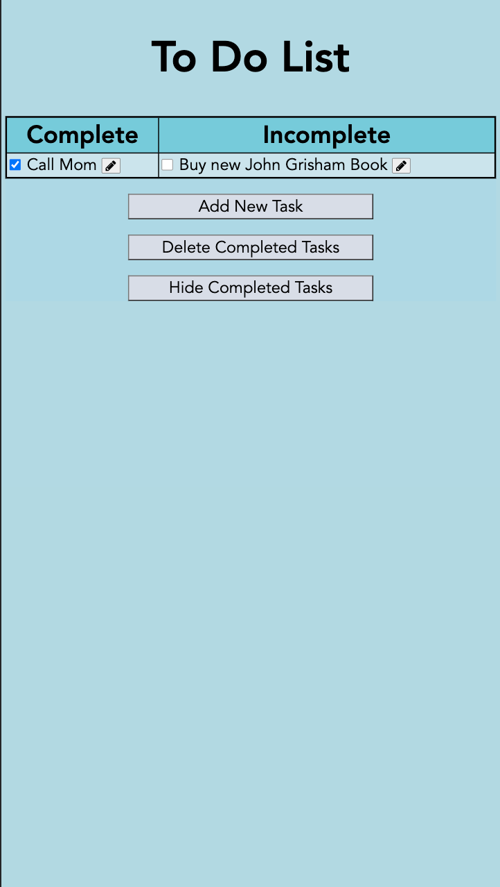

# Challenges
One of the major challenges we faced was understanding the requirements of the lab. Initially, we thought we needed to create a fully functional todo list web application with only HTML and CSS. After a lot of confusion we realized we only needed to hard code the images. We then faced some challenges decided which of our designs were better, but we were able to decide after some discussion with potential users over which design was more instinctive.

We faced some trouble working on the actual CSS to format some of the items that were not as customizable, such as the checkboxes. We also faced some issues about the best way to handle user testing. In the end we used the talk aloud method we discussed in a previous homework.

# What we're proud of
We are really proud of our table format because we believe separating our complete and incomplete tasks made our design a lot more usable. We also think our color choices really emphasize our design and add to the aesthetics of our page which also adds to the perception of usability.

Finally, we are very proud of the way we chose to have a separate page and UI for adding new tasks and editing tasks. We believe that keeping this separate made our design clearer and simpler, and furthermore having the new task and edit task page be very similar also allows users to understand these pages easily.
