# Design decisions
We decided on creating separate pages for adding items, modifying items, and the original list to make our code as modularized as possible. Here are final designs for each of our pages:
## Adding items
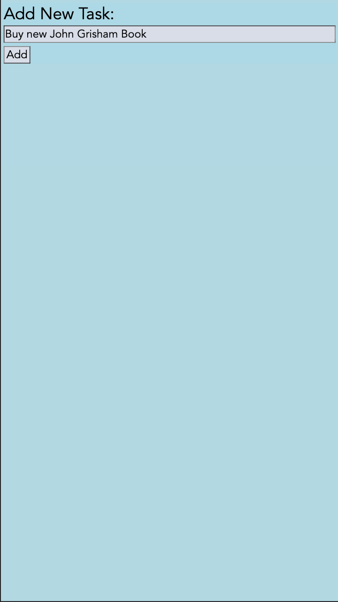
## Modifying items
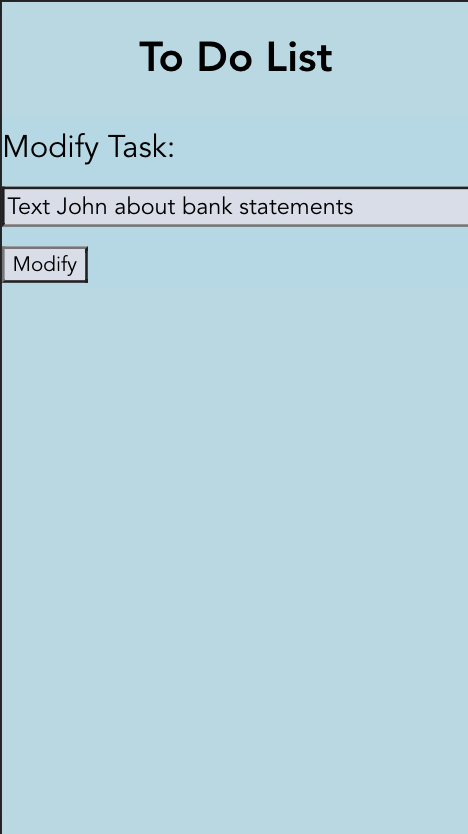
## Original list
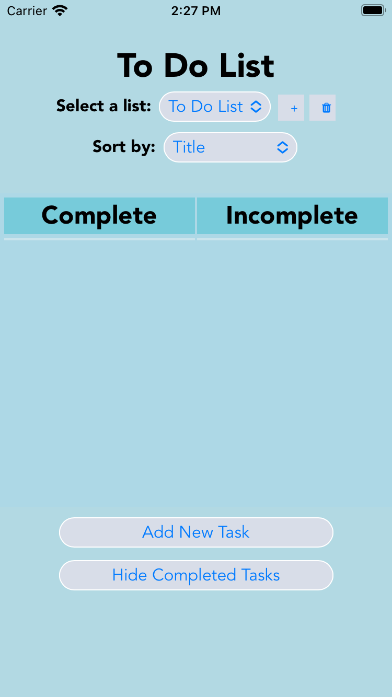
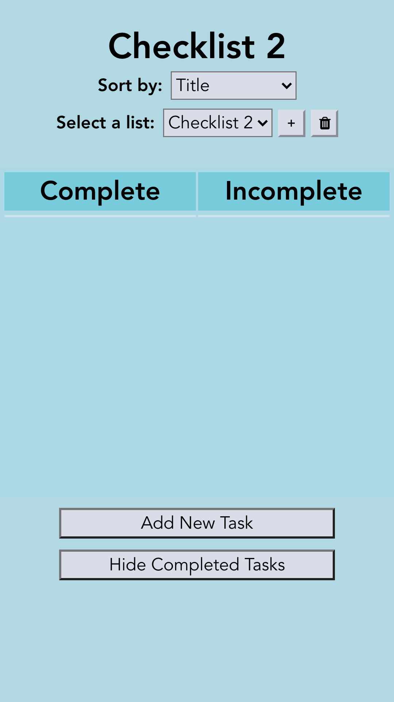
## Adding a new list
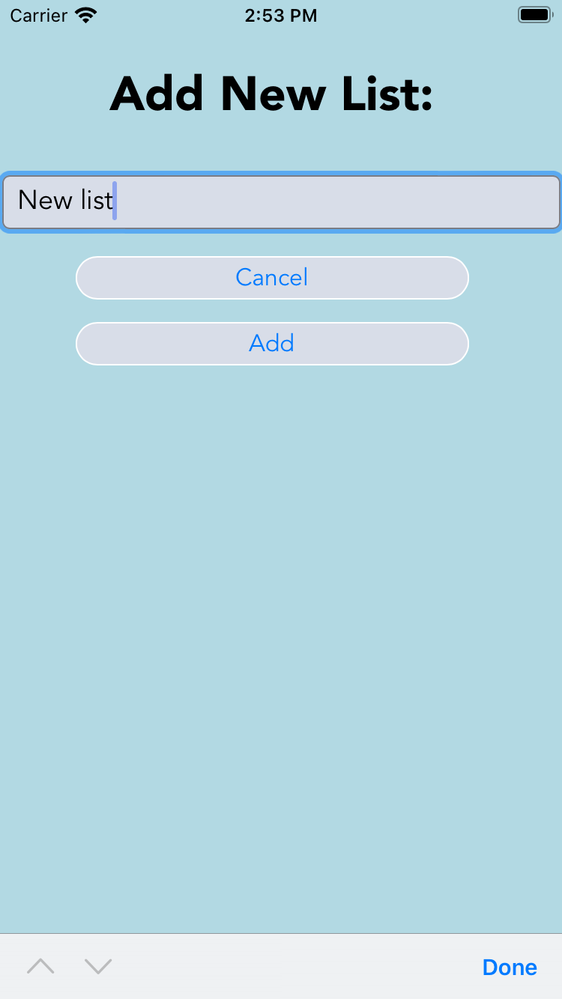
## Deleting a list
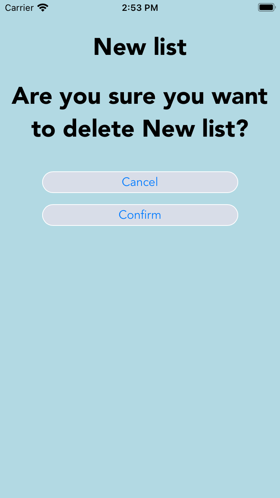

# Alternative designs
## Initial ideas
Initially, we wanted to do only two separate pages, one to modify items and another to add items and hold the whole to do list. We ended up deciding to do a separate page for adding items, as you will see later, to keep our to do list page as simple and readable for the user as possible.

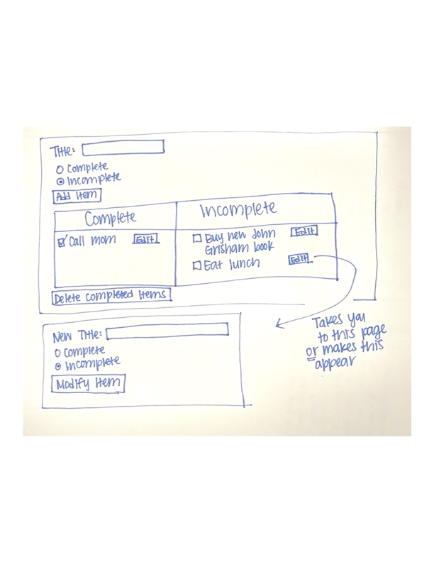

## First iteration of final design
This is our first iteration of separate pages to add tasks, modify tasks, and hold our whole to do list. We decided that this was the overall way to go since it made the actual to do list as simple and easy to read as possible, however we wanted to play with moving around buttons and fixing the text to be as clear and readable as possible.

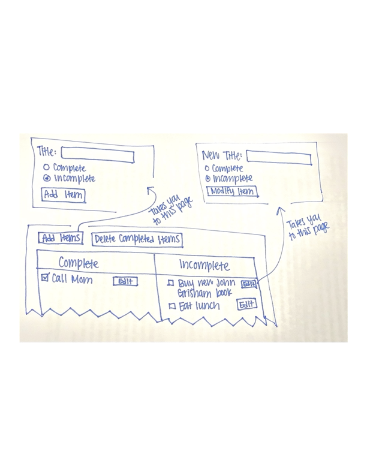

## Cleaning up final design
This is what we decided on for our final design. We focused on making it modularized, easy to use, and as intuitive as possible. We made our labels descriptive while minimizing text so that users wouldn't have to read very much, but could just skim to get an easy understanding of what to do.

In this next iteration, we decided to add in cancel buttons for add task and modify task pages. We also added a dropdown for priority when adding the task to restrict user options for selecting priority. These priorities are listed next to the task name. Additionally, we added a dropdown to select how to sort the to do list. The options are by title, creation date, and priority. In keeping to the 80/20 rule, we decided to only allow users to sort in the ascending direction.

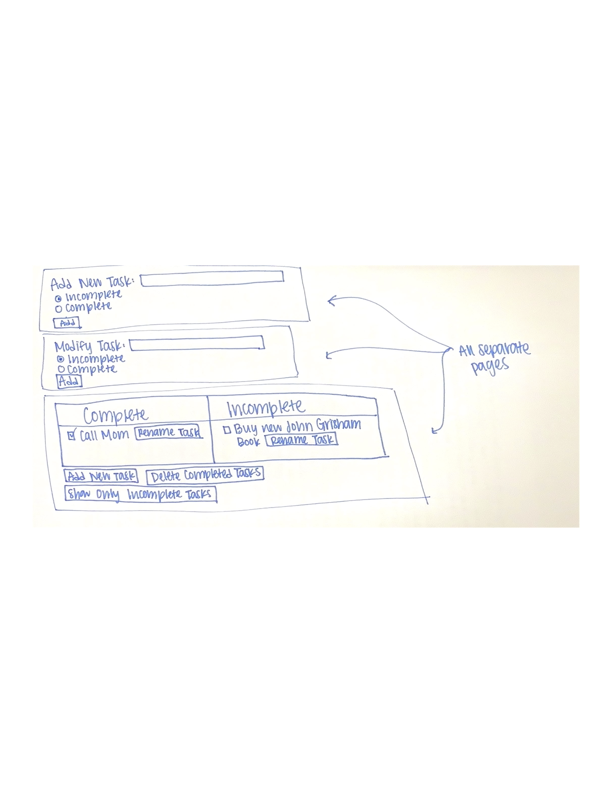

# User testing
We asked three separate users to click through our webpages and talk through their thinking as they were doing so out loud. We discovered that the font we had originally chosen was sort of hard to read and distracting (we were using a typewriter type font), so we decided to change our font to that in our final design. Additionally, it became clear that the buttons became confusing when they were all displayed on every page, so we displayed only relevant buttons.

We asked three separate users to click through our webpages and talk through their thinking as they were doing so out loud. We found that using a pencil icon as our modify button was confusing to some of our users. We decided to change our button to feature the text "modify" instead. 

We asked three separate users to click through our webpages and talk through their thinking as they were doing so out loud. We found that they occasionally clicked add and modify tasks without meaning to, so we added in the option to cancel these operations. We also found that they preferred a dropdown for selecting what to sort by, as well as priority, since it gave them their options clearly and quickly. We found that they didn't want to sort in a descending order and much preferred to sort ascending, so we decided to keep ascending as their only option to simplify the app.

We asked three separate users to click through our webpages and talk through their thinking as they were doing so out loud. We found that they didn't want to scroll in landscape view so we implemented responsive design. We also found that they found it intuitive to have the delete list and add list buttons right next to the list dropdown as icons rather than spelled out.

# Final design
## In an empty list, create an item named "Buy new John Grisham book"

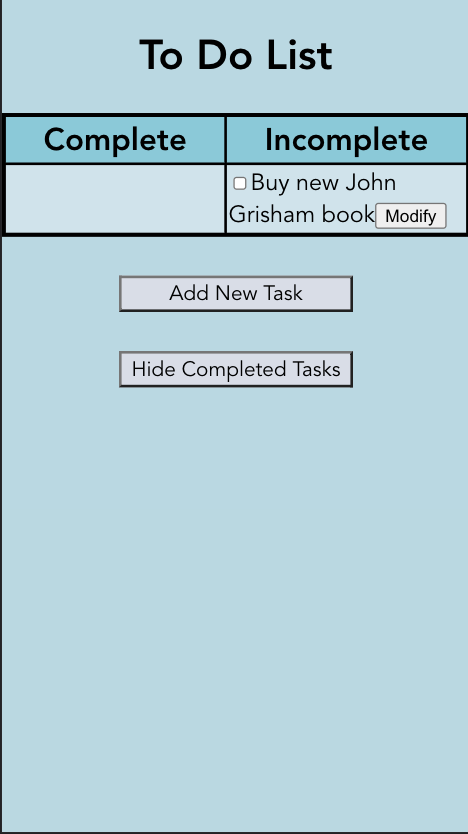
## In a non-empty list, create an item named "Eat Lunch"

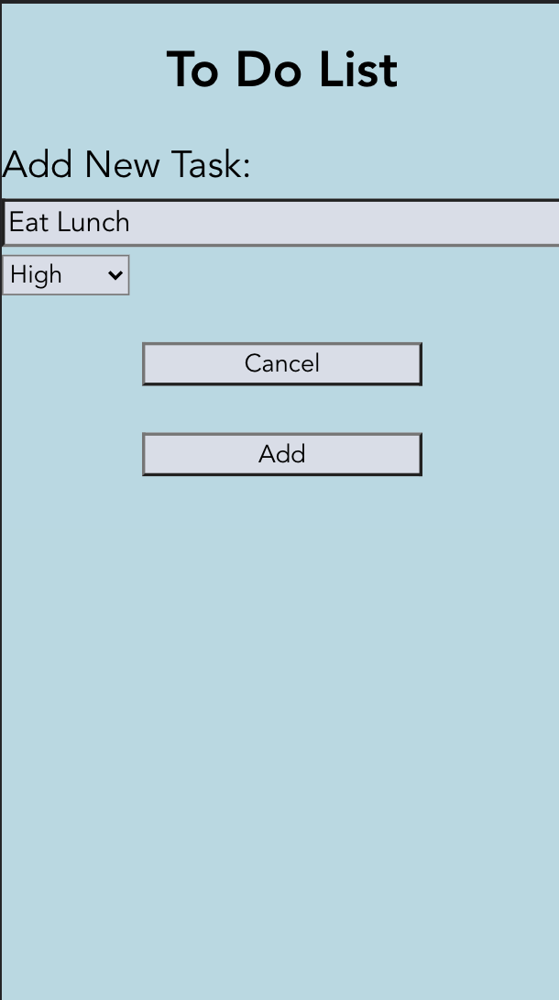
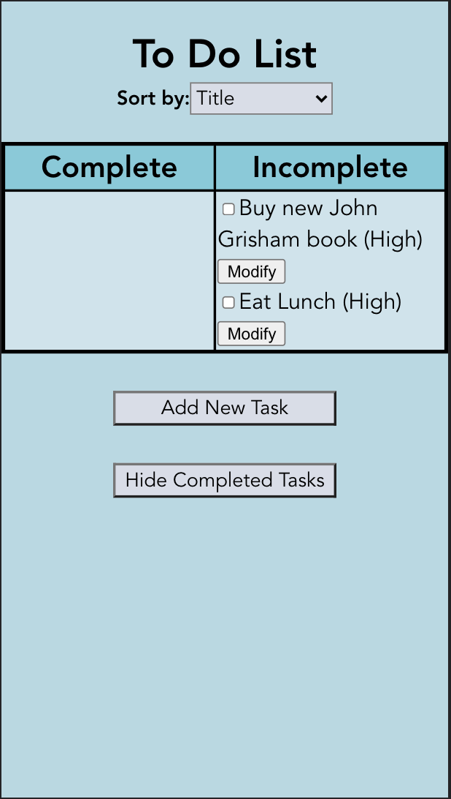
## Mark the item named "Call Mom" completed (assumes there exists an item named "Call Mom").
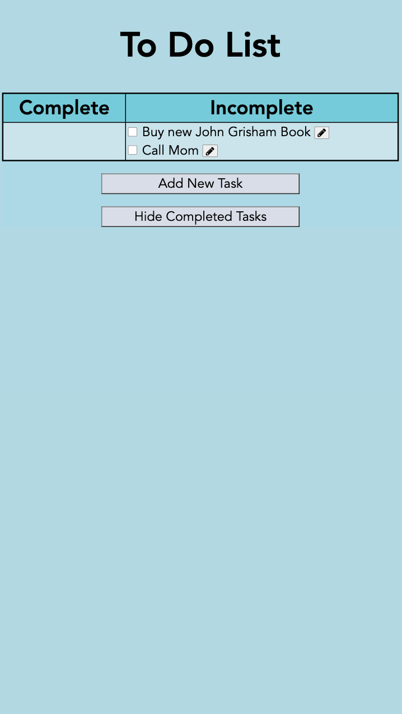
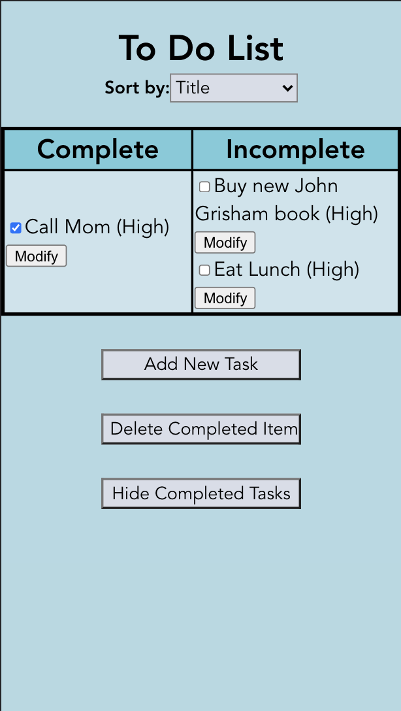
## Rename the item "Text John" to "Text John about bank statements" (assumes there exists an item named "Text John").

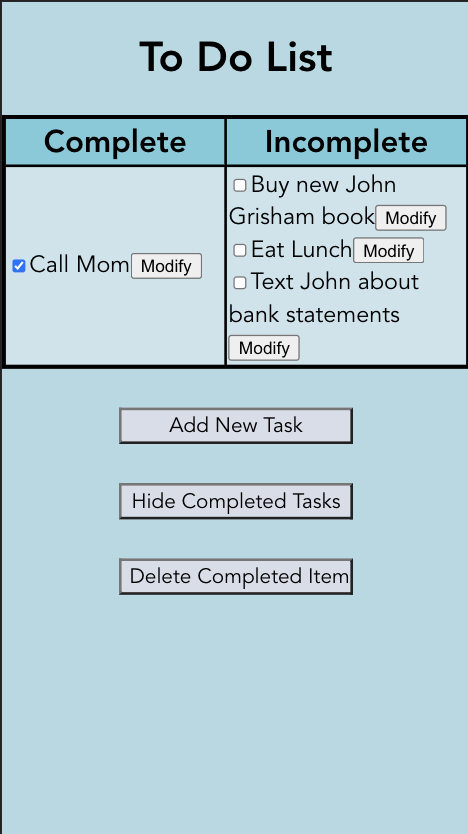
## Show all uncompleted tasks.

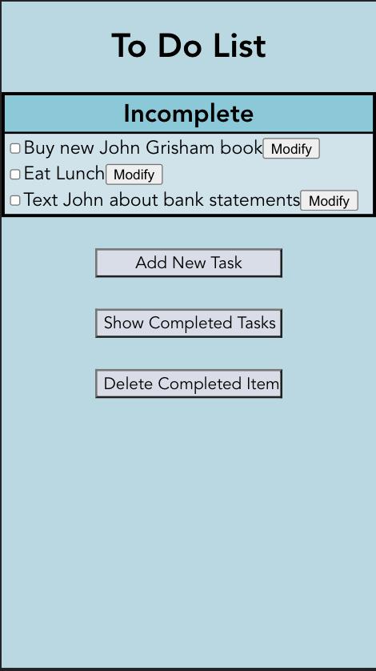
## Delete all completed tasks.

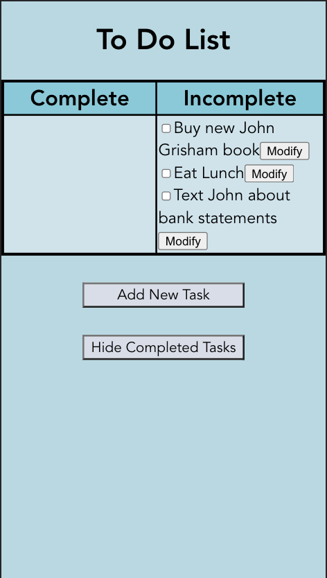

# Challenges
One of the major challenges we faced was understanding the requirements of the lab. Initially, we thought we needed to create a fully functional todo list web application with only HTML and CSS. After a lot of confusion we realized we only needed to hard code the images. We then faced some challenges decided which of our designs were better, but we were able to decide after some discussion with potential users over which design was more instinctive.

We faced some trouble working on the actual CSS to format some of the items that were not as customizable, such as the checkboxes. We also faced some issues about the best way to handle user testing. In the end we used the talk aloud method we discussed in a previous homework.

When creating our React app we faced issues updating our states because we didn't realize that updating our state was done asynchronously, and therefore our page was being re-rendered before our states were being updated.

In lab 4, we really struggled with restructuring the Firebase data to accommodate for the multiple lists. We also had a hard time with some of the styling for responsive design.

# What we're proud of
We are really proud of our table format because we believe separating our complete and incomplete tasks made our design a lot more usable. We also think our color choices really emphasize our design and add to the aesthetics of our page which also adds to the perception of usability.

Finally, we are very proud of the way we chose to have a separate page and UI for adding new tasks and editing tasks. We believe that keeping this separate made our design clearer and simpler, and furthermore having the new task and edit task page be very similar also allows users to understand these pages easily.

In lab 4, we're proud of the multiple list functionality, since this took a while to implement. We're also proud of the responsive design components and how we've grown in our ability to use CSS to produce something that's quite pretty.

# Accessibility Videos
https://drive.google.com/file/d/1VpTwc0aN9i3gXtVlyVz_iAGYEdjZnNnb/view?usp=sharing
https://drive.google.com/file/d/1W-TJl1KOlDrw8Mrcf2Z5IR4WL4Gk-qQM/view?usp=sharing
