# Design decisions
We decided on creating separate pages for adding items, modifying items, and the original list to make our code as modularized as possible. Here are final designs for each of our pages:
## Adding items
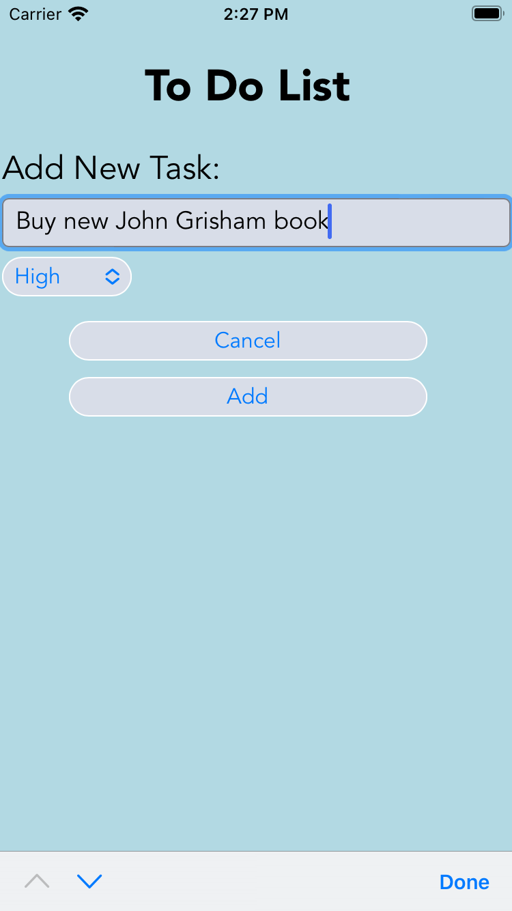
## Modifying items
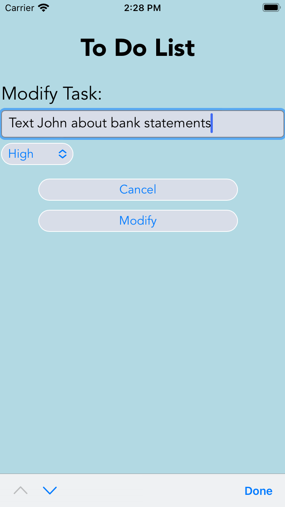
## Original list
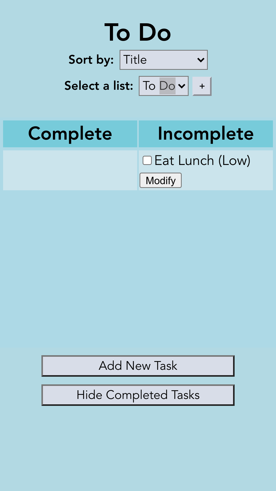

## Adding a new list
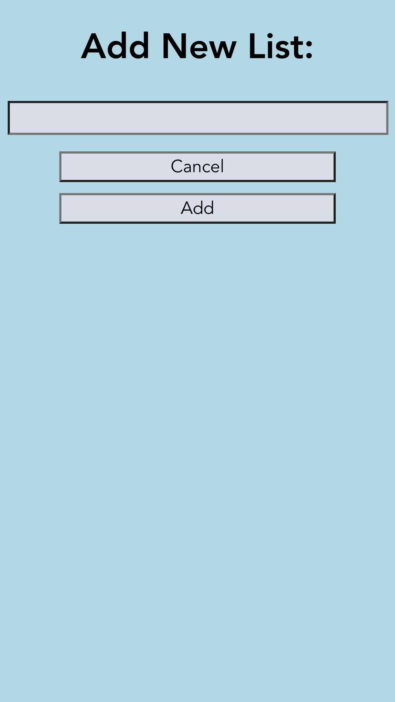
## Deleting a list
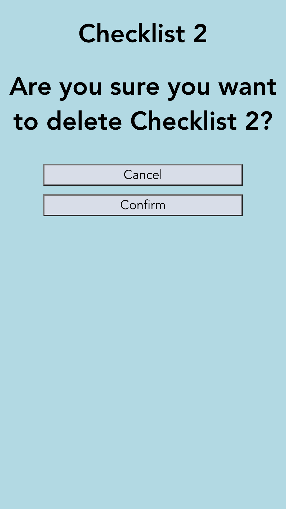

## Design decisions for sharing lists
In the process of adding functionality to allow users to share lists we had to make several decisions on what rules this would follow. 
We decided that if user A shares a list with user B, user B should not be able to share that list with user C. We felt this had better privacy for users and allowed the initial user more control over their list.
We decided if user A shares a list with user B, user B should not be allowed to delete that list because they are not the owner. We felt only the original list creator should be allowed to delete a list. In order to address any issues arising from this, we decided to allow user B(and other users who have lists shared with them) to "leave" a list, meaning they can stop having the list shared with them, but the list will still exist for the owner and other users the list is shared with.
We decided that if user A shares a list with user B, user B would not need to accept that sharing. Instead, the shared list just show up for user B. As mentioned above we handled any issues with this by allowing user B to leave a list.
We chose to make shared lists be distinguishable in the UI from unshared lists. For the owner of a document, they can view who they have shared lists with in their settings page(and also remove sharing with users as well). For users a document has been shared with, the list title is displayed as a heading and in the dropdown list selector as "List title (shared)".
Finally, we decided if user A shares a list with user B, user B should not see that list if they don't have an authenticated email address. This is to protect security in case a user is using someone elses email and has not verified it.

We chose to create a settings page for lists owned by the user. This page allows users to delete their list, share their list, and remove sharing for specific users. 

# Alternative designs
## Initial ideas
Initially, we wanted to do only two separate pages, one to modify items and another to add items and hold the whole to do list. We ended up deciding to do a separate page for adding items, as you will see later, to keep our to do list page as simple and readable for the user as possible.

## First iteration of final design
This is our first iteration of separate pages to add tasks, modify tasks, and hold our whole to do list. We decided that this was the overall way to go since it made the actual to do list as simple and easy to read as possible, however we wanted to play with moving around buttons and fixing the text to be as clear and readable as possible.

## Cleaning up final design
This is what we decided on for our final design. We focused on making it modularized, easy to use, and as intuitive as possible. We made our labels descriptive while minimizing text so that users wouldn't have to read very much, but could just skim to get an easy understanding of what to do.

In this next iteration, we decided to add in cancel buttons for add task and modify task pages. We also added a dropdown for priority when adding the task to restrict user options for selecting priority. These priorities are listed next to the task name. Additionally, we added a dropdown to select how to sort the to do list. The options are by title, creation date, and priority. In keeping to the 80/20 rule, we decided to only allow users to sort in the ascending direction.

# User testing
We asked three separate users to click through our webpages and talk through their thinking as they were doing so out loud. We discovered that the font we had originally chosen was sort of hard to read and distracting (we were using a typewriter type font), so we decided to change our font to that in our final design. Additionally, it became clear that the buttons became confusing when they were all displayed on every page, so we displayed only relevant buttons.

We asked three separate users to click through our webpages and talk through their thinking as they were doing so out loud. We found that using a pencil icon as our modify button was confusing to some of our users. We decided to change our button to feature the text "modify" instead. 

We asked three separate users to click through our webpages and talk through their thinking as they were doing so out loud. We found that they occasionally clicked add and modify tasks without meaning to, so we added in the option to cancel these operations. We also found that they preferred a dropdown for selecting what to sort by, as well as priority, since it gave them their options clearly and quickly. We found that they didn't want to sort in a descending order and much preferred to sort ascending, so we decided to keep ascending as their only option to simplify the app.

We asked three separate users to click through our webpages and talk through their thinking as they were doing so out loud. We found that they didn't want to scroll in landscape view so we implemented responsive design. We also found that they found it intuitive to have the delete list and add list buttons right next to the list dropdown as icons rather than spelled out.

We asked three separate users to click through our webpages and talk through their thinking as they were doing so out loud. We found that they did not like editing the shared with users being on a separate page to the page to share a list with a new user so we decided to combine these into 1 page. We also found that in the new settings page they preferred having the delete list button be spelled out rather than an icon. Users also wanted to be able to see which account they were signed into so we added text to tell them.

# Final design
## In an empty list, create an item named "Buy new John Grisham book"

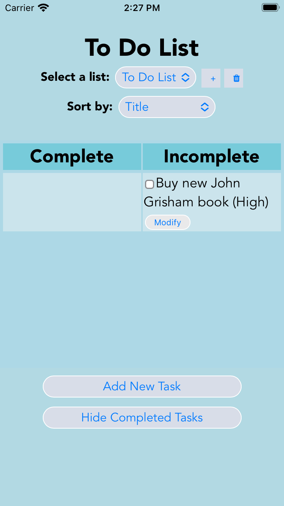
## In a non-empty list, create an item named "Eat Lunch"

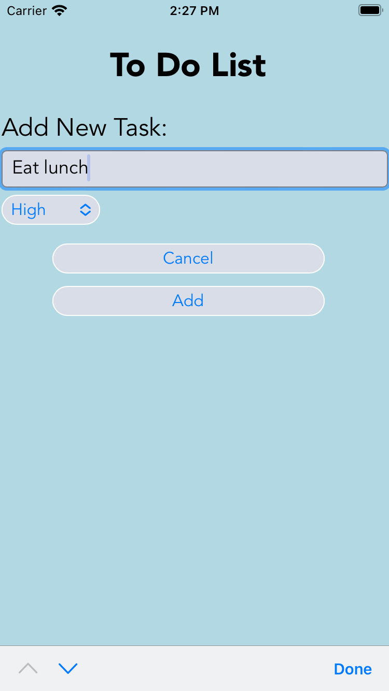
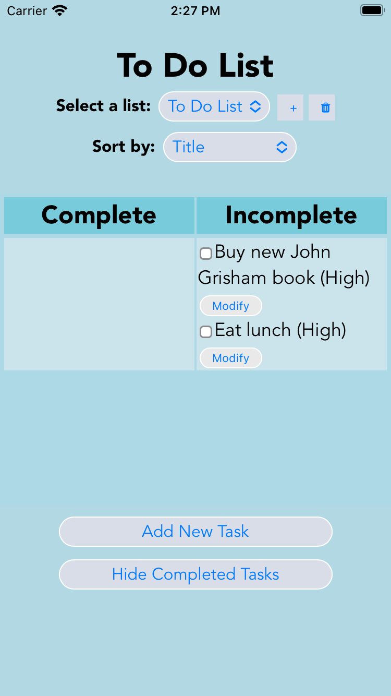
## Mark the item named "Call Mom" completed (assumes there exists an item named "Call Mom").
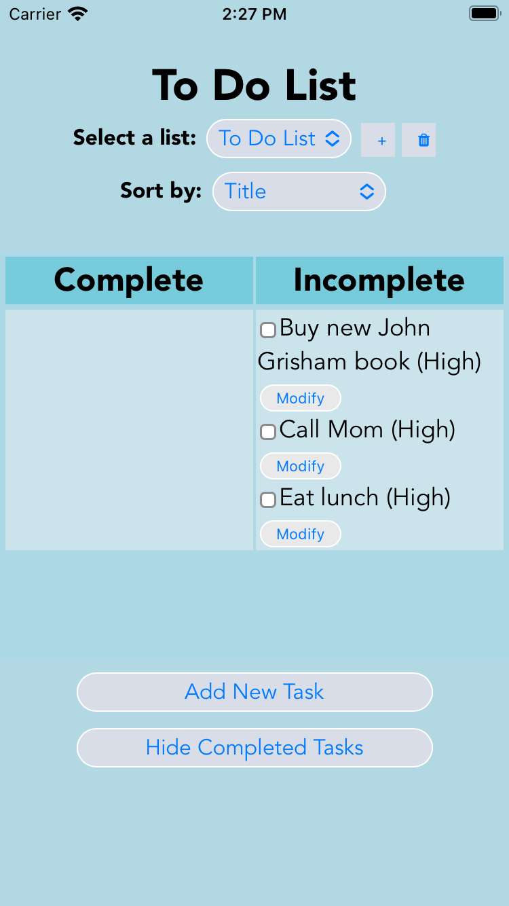

## Rename the item "Text John" to "Text John about bank statements" (assumes there exists an item named "Text John").
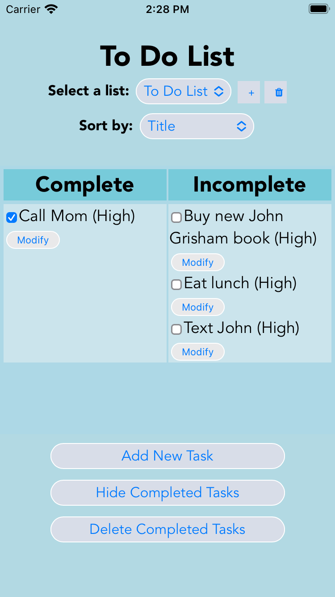

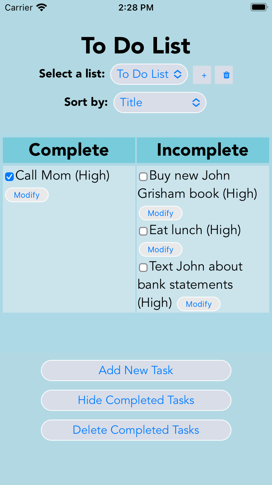
## Show all uncompleted tasks.

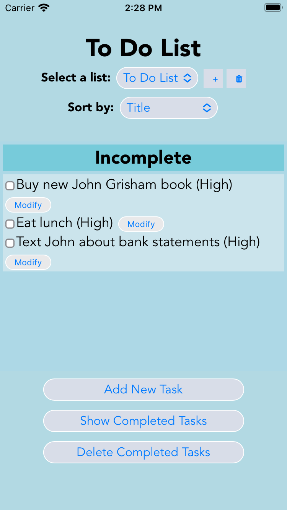
## Delete all completed tasks.

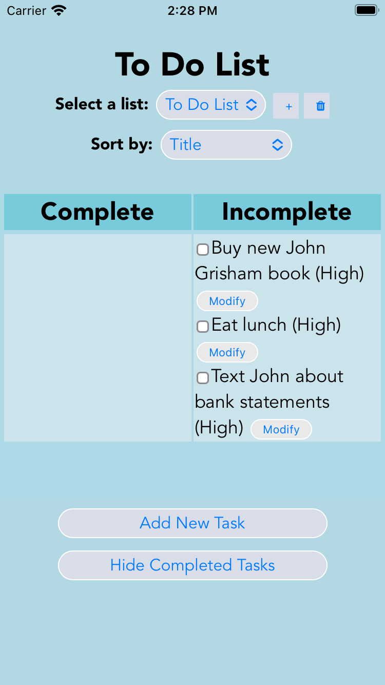

# Challenges
One of the major challenges we faced was understanding the requirements of the lab. Initially, we thought we needed to create a fully functional todo list web application with only HTML and CSS. After a lot of confusion we realized we only needed to hard code the images. We then faced some challenges decided which of our designs were better, but we were able to decide after some discussion with potential users over which design was more instinctive.

We faced some trouble working on the actual CSS to format some of the items that were not as customizable, such as the checkboxes. We also faced some issues about the best way to handle user testing. In the end we used the talk aloud method we discussed in a previous homework.

When creating our React app we faced issues updating our states because we didn't realize that updating our state was done asynchronously, and therefore our page was being re-rendered before our states were being updated.

In lab 4, we really struggled with restructuring the Firebase data to accommodate for the multiple lists. We also had a hard time with some of the styling for responsive design.

In lab 5, we had difficulty handling the Firebase security rules and updating these rules to allow list sharing. We frequently found that we had insufficient permissions. We also struggled with how to intitially retrieve the data from the firebase and view both the lists a user owned and the lists that were shared with that user.

# What we're proud of
We are really proud of our table format because we believe separating our complete and incomplete tasks made our design a lot more usable. We also think our color choices really emphasize our design and add to the aesthetics of our page which also adds to the perception of usability.

Finally, we are very proud of the way we chose to have a separate page and UI for adding new tasks and editing tasks. We believe that keeping this separate made our design clearer and simpler, and furthermore having the new task and edit task page be very similar also allows users to understand these pages easily.

In lab 4, we're proud of the multiple list functionality, since this took a while to implement. We're also proud of the responsive design components and how we've grown in our ability to use CSS to produce something that's quite pretty.

In lab 5, we were very proud of how we were able to edit the firebase security rules as this was something that had previously confused us in in-class assignments. We also were very proud of our new "settings" page and how it seemed to combine a lot of functionality.

# Accessibility Videos
https://drive.google.com/file/d/1VpTwc0aN9i3gXtVlyVz_iAGYEdjZnNnb/view?usp=sharing
https://drive.google.com/file/d/1W-TJl1KOlDrw8Mrcf2Z5IR4WL4Gk-qQM/view?usp=sharing
